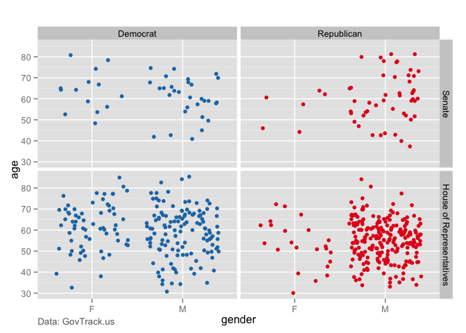
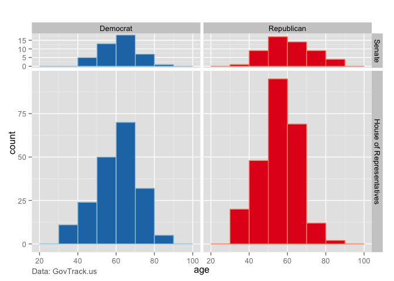
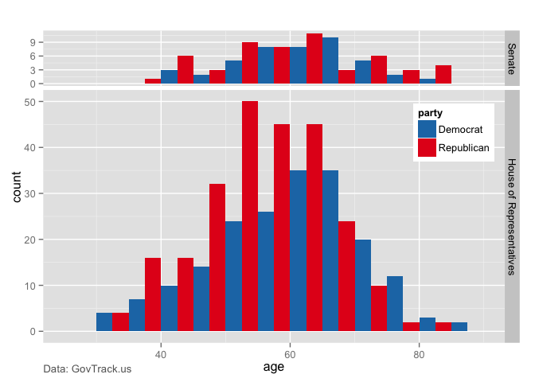

# Visualizations of the Ages of Members of the US Congress
Edward Visel  
March 26, 2015  

A quick R script to make visualizations of the ages of Members of the US Congress.
Data is from GovTrack.us, accessed 2015-03-24, available at 
https://www.govtrack.us/developers/data, specifically 
https://www.govtrack.us/data/congress-legislators/legislators-current.csv.

Data import assumes the script is saved in the same file as the data, which is 
named "legislators-current.csv". Output files are saved to the same directory 
as "congressAge.png" (currently only saving the "hist2" plot). Update paths and 
data as necessary.

Dependencies
------------
- R environment
- lubridate package
- ggplot2 package

All dependencies are available free form CRAN: http://www.cran.r-project.org/

Results
-------


```r
#!/usr/bin/Rscript

## An R script to graph the age of Members of Congress by party and house.
## Data downloaded 2015-03-24 from govtrack.us: https://www.govtrack.us/developers/data

## Load dependencies, import data
library('lubridate')
library('ggplot2')
data <- read.csv('legislators-current.csv')

## Calculating and adding age column from birthday
age <- c()
for (i in 1:nrow(data)) {
    age <- c(age, as.integer(substr(as.period(
                  interval(data$birthday[i], now())), 1, 2)))
}
data <- cbind(data, age)


## Cleaning and reorganizing data
levels(data$type) <- c('House of Representatives', 'Senate')
data$type <- relevel(data$type, 'Senate')
drdata <- data[data$party %in% c('Democrat', 'Republican'),]
```


```r
## Plotting jitter plot by gender
cols <- c('Democrat'='#1f78b4', 'Republican'='#e41a1c')
accents <- c('Democrat'='#9ecae1', 'Republican'='#fc9272')

# jitter <- 
qplot(gender, age, data=drdata, geom='jitter', color=party, 
      main='Data: GovTrack.us') +
    scale_color_manual(values=cols) +
    guides(fill=FALSE, color=FALSE) +
    theme(legend.justification=c(1,1), legend.position=c(1,.8),
         plot.title=element_text(vjust=-44.7, hjust=0, size=10, color='gray40')) +
    facet_grid(type ~ party, scales='free_x')
```

 

```r
## Plotting histograms

# hist1 <-
qplot(age, data=drdata, geom='histogram', binwidth=10, fill=party, 
               color=party, main='Data: GovTrack.us') +
    scale_fill_manual(values=cols) +
    scale_color_manual(values=accents) +
    guides(fill=FALSE, color=FALSE) +
    theme(legend.justification=c(1,1), legend.position=c(1,.8),
         plot.title=element_text(vjust=-44.7, hjust=0, size=10, color='gray40')) +
    facet_grid(type ~ party, space='free', scales='free_y')
```

 

```r
# hist2 <- 
qplot(age, data=drdata, geom='bar', binwidth=5, fill=party, 
               position='dodge', main='Data: GovTrack.us') +
    scale_fill_manual(values=cols) +
    scale_color_manual(values=accents) +
    guides(color=FALSE) +
    theme(legend.justification=c(1,1), legend.position=c(1,.8),
          plot.title=element_text(vjust=-44.7, hjust=0, size=10, color='gray40')) +
    facet_grid(type ~ ., space='free', scales='free_y')
```

 

```r
# ggsave(filename='congressAge.png', plot=hist2, 
#        width=6, height=6, units='in', dpi=100)
```
